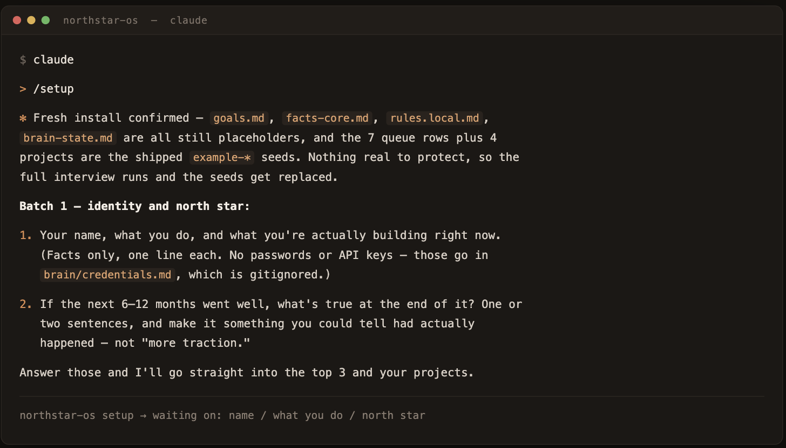
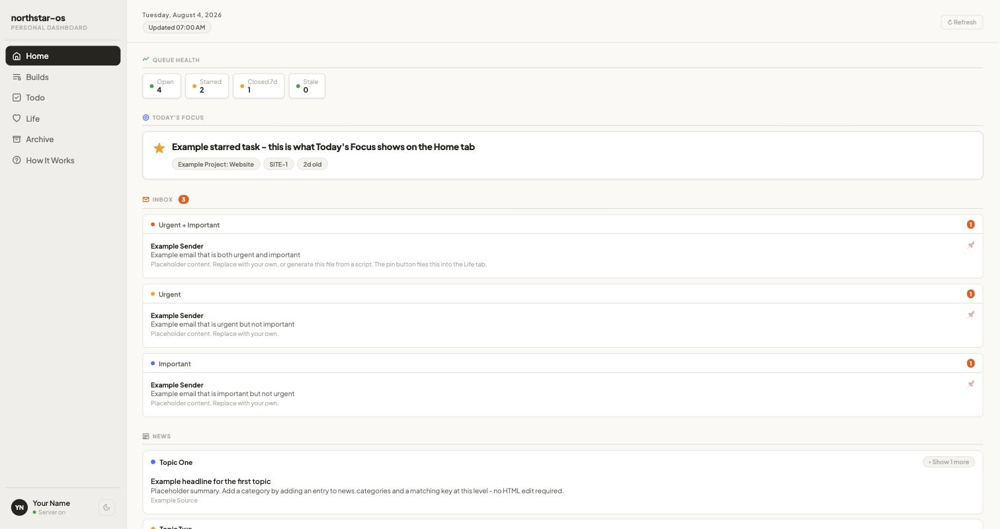
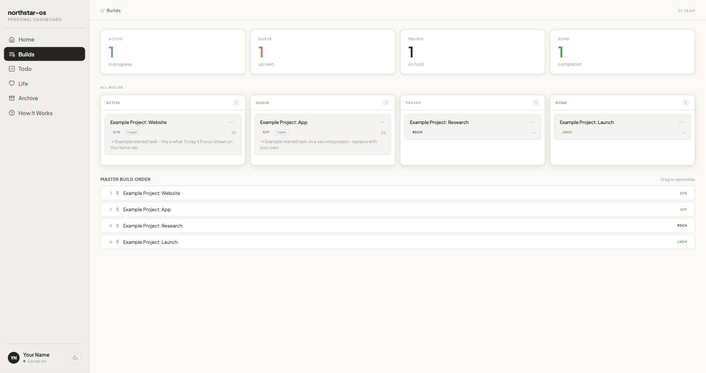

# northstar-os

**It catches you rabbit-holing. It runs itself. Setup takes five minutes.**

You know the feeling of surfacing after three hours and realizing none of it mattered. Your AI
watched the whole thing and said nothing, because it had no idea what you were supposed to be doing.

northstar-os gives it your ranked goals, and then it interrupts you. Mid-answer, in the same turn,
not in a summary afterwards: *"heads up, your #1 is the launch, and this doesn't move it."* You can
keep going. It just stops being an accident.

The other half is that it costs you nothing to keep. No cron, no daily grooming, no weekly tidy-up.
Files cap themselves and rotate their own history. The weekly review remembers it's due on its own.
It proposes its own improvements, scored against your goals, and the default answer is no.

**Five minutes to adopt it.** Clone it, type `/setup`, answer some questions about what you're
trying to do. It writes your goals, your facts, your working style, and your first queue.



And none of it is a rule you have to trust it to follow. **Every one is a hook, a cap, or a schema
check** — the state file physically cannot grow past its cap, because the commit gets blocked.



---

## Install

```bash
git clone https://github.com/gutowskid777/northstar-os
cd northstar-os
bash brain/tools/install.sh
claude
```

then type `/setup`.

The setup command interviews you: your north star, your top 3 ranked, your live projects, how blunt
you want it, and what's currently on your plate. Then it writes your brain, seeds your queue, and
gives you your first move. A few minutes, and nothing to fill in by hand.

Requirements: [Claude Code](https://claude.com/claude-code), `git`, and `python3`. No npm, no
dependencies, no accounts, no API keys. Everything is files on your disk.

On first launch Claude Code will ask you to approve the project hook in `.claude/settings.json`.
That's `brain/tools/reply-brevity.sh`, nine lines of `cat`, and you should read it before you say
yes. Approving a hook from a repo you cloned without reading it is a bad habit and this one is
short enough that you don't have to.

---

## What you get

**A brain that loads in four files.** `brain-state.md` (what's happening), `goals.md` (the ranking),
`rules.md` (how it behaves), `facts-core.md` (things it must never invent about you). All four are
size-capped, so session startup stays cheap forever instead of slowly eating your context window.

**One queue.** `brain/queue.json`. Every task, idea, and open decision in a single file. Ideas park
by default and only graduate by out-ranking something you're already doing. "Noted" without a row
means not noted.

**A dashboard.** `python3 serve.py`, then `127.0.0.1:8000`. Your brief, your projects on a kanban,
your todos, a nested life list, an archive. One HTML file and one Python file, both zero-dependency,
localhost only.



**Guard rails that hold when nobody's watching.** See below.

---

## The part nobody else has

Every "AI second brain" repo ships rules. Rules get read once at session start and buried by turn
forty. You can write the same rule in seven different files and it still fades, because the problem
was never that the rule was missing. The problem is distance.

So the rules here are backed by mechanisms:

| The rule | What actually enforces it |
|---|---|
| Keep state small | Pre-commit hook rejects `brain-state.md` over 150 lines or 12KB |
| Don't corrupt the queue | Schema check: unique ids, required fields, `_meta.count` must match reality |
| Don't let a stale session erase your work | Mass-erase guard blocks any commit dropping 10+ row ids without a rotation file alongside it |
| Never commit a secret | Regex scan of every staged addition, plus a hard block on `credentials.md` |
| Keep replies short | A `UserPromptSubmit` hook that reinjects the contract on every single message |
| Run the weekly review | A watermark in `routines/config.json`, checked at session start |

The install script deliberately trips the guard so you watch it block a bad commit before you trust
it with anything.

**Nothing is ever deleted.** State overflows into `brain/history/decisions-YYYY-MM.md`. Closed queue
rows rotate into `brain/history/queue-closed-YYYY-MM.json`. Rotation fires at 90% of cap rather than
on a schedule, because a ritual you perform every session is upkeep, and upkeep is the exact thing
this is built to avoid.

---

## Try it before you set it up

```bash
python3 serve.py
```

The dashboard boots with example data so every tab has something in it. `example/` holds a fully
populated brain for a fictional user, so you can see what a filled-in `goals.md`, `queue.json`, and
`brain-state.md` actually look like before you write your own.

---

## Layout

```
CLAUDE.md              55 lines. Zero live data. Names the four files to read at session start.
AGENTS.md              The same contract for Codex, Cursor, and anything else.
brain/
  brain-state.md       Live state. Capped at 150 lines.
  goals.md             The ranked anchor. Everything is scored against this.
  rules.md             The constitution. Generic, safe to pull updates into.
  rules.local.md       Your working style. Yours, never overwritten.
  facts-core.md        Atomic facts. Capped at 50 lines.
  queue.json           THE queue. Capped at 250 rows.
  history/             Where everything rotates. Nothing is deleted.
  routines/            Weekly review, Your Move, capture, grind mode. Plus the watermark file.
  tools/               brain-guard.sh, reply-brevity.sh, install.sh
.claude/
  settings.json        Wires the reply hook via $CLAUDE_PROJECT_DIR. Cloning is the install.
  commands/            /setup  /sync  /weekly-review  /move
serve.py               Zero-dependency dashboard server, localhost only.
dashboard/             One HTML file plus seed data.
example/               A fictional user's fully populated brain.
docs/                  how-it-works.md, customizing.md
```

---

## Make it yours

`rules.md` is generic and `rules.local.md` is yours, so you can pull updates to the constitution
without losing your own preferences. `/setup` writes the local file; after that, add to it whenever
you catch yourself giving the same correction twice. That is the highest-value maintenance this
system asks of you, and it's optional.

`docs/customizing.md` covers adding routines, adding slash commands, changing the caps, and turning
individual guards off.

---

## Security

`serve.py` binds `127.0.0.1` only, refuses cross-origin writes, requires
`Content-Type: application/json`, serves nothing outside `dashboard/`, and writes atomically with a
backup. It's still unauthenticated by design, because it's a single-user local tool. **Don't
port-forward it and don't run it on a shared machine.**

If you fork this and make your fork public, blank `brain/facts-core.md` and the People section
first, and check `git log -p` before you push. `credentials.md` is gitignored and guard-blocked, but
git history is forever and the guard only runs on commits made after you install it.

---

## Roadmap

- A contacts module (relationship cadences, follow-up nudges), currently held back because it needs
  its editor ported before it would be usable rather than decorative.
- Optional phone mirror for Your Move.

---

MIT. Built by [Dylan Gutowski](https://github.com/gutowskid777).
Issues and PRs welcome, especially "this broke on my machine."
